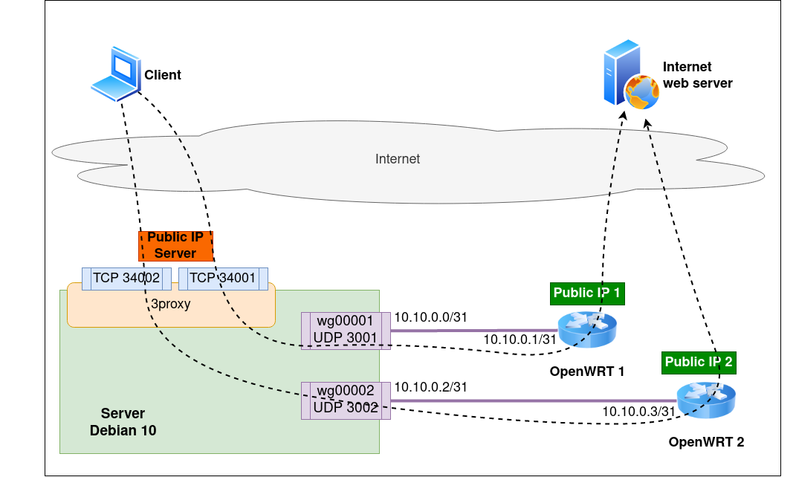

# Wireguard tunnels for multi exit points

[Russin version](README.ru.md)

## Description

Using wireguard for tunneling the proxy packets via remote OpenWRT devices.

### Scheme



### Files

| File                  | Description                                |
|-----------------------|--------------------------------------------|
| create_tunnel.sh      | Create db files for the tunnel             |
| start_tunnel.sh       | Start tunnel interface                     |
| stop_tunnel.sh        | Stop tunnel interface                      |
| show_tunnel.sh        | Show system related info for the tunnel    |
| getstat_tunnel.sh     | Get status of the tunnel                   |
| wrt_create_tunnel.sh  | Shell commands to start tunnel on OpenWRT  |
| wrt_destroy_tunnel.sh | Shell commands to stop tunnel on OpenWRT   |
| source.sh             | Common bash functions and vars             |

## Usage

### Install Wireguard

##### Debian server

```bash
sudo apt-get update
sudo apt-get install wireguard
```

##### OpenWRT

```bash
opkg update
# 21.02 or above
opkg install wireguard-tools
# 19.07 or lower
opkg install wireguard
```

### Wireguard scripts (server only)

##### Fetch repository

```bash
git clone https://github.com/LovingFox/reverse_vpn.git
cd reverse_vpn
```

##### Create files for wireguard tunnel

```bash
./create_tunnel.sh <ID> <IP> <IP remote> <UDP> <table ID> <rule ID>
```

The command creates files for the tunnel in `./db` directory

1. `<ID>` unique id of the tunnel -- just an arbitrary number
1. `<IP>` local IP address of the tunnel
1. `<IP remote>` remote IP address of the tunnel (on the OpenWRT)
1. `<UDP>` free UDP port for the tunnel that wiregard will listen
1. `<table ID>` free unique routing table id for the tunnel (*ip route show table `<table ID>`*)
1. `<rule ID>` free unique rule id for the tunnel (*ip rule show pref `<table ID>`*)

> `<IP>` and `<IP remote>` have to be in the same /31 subnet

Example

```bash
./create_tunnel_files.sh 1 10.10.0.0 10.10.0.1 3001 1001 1001
./create_tunnel_files.sh 2 10.10.0.2 10.10.0.3 3001 1001 1001
```

##### Start tunnel

```bash
./start_tunnel.sh <ID | wg interface | IP local | IP remote | all>
```

> `<parameter>` can be set more then once, separated by space  
`all` leads to the fact that everyone available tunnels in `./db` will be affected

Example

```bash
./start_tunnel.sh 1
./start_tunnel.sh 1 2
./start_tunnel.sh wg00001
./start_tunnel.sh wg00001 wg00002
./start_tunnel.sh 10.10.0.0
./start_tunnel.sh 10.10.0.1
./start_tunnel.sh 10.10.0.2
./start_tunnel.sh 10.10.0.0 10.10.0.2
./start_tunnel.sh wg00001 10.10.0.0
./start_tunnel.sh all
```

> such approach is correct for all next commands

##### Stop tunnel

```bash
./stop_tunnel.sh <ID | wg interface | IP local | IP remote>
```

##### Show tunnel related info in system

```bash
./show_tunnel.sh <ID | wg interface | IP local | IP remote>
```

##### Get tunnels statistics in a table form

```bash
./getstat_tunnel.sh <ID | wg interface | IP local | IP remote>
```

Example

```bash
$ ./getstat_tunnel.sh all
***|  UP   wg00001  3001       10.10.0.0    192.168.200.13:52122  100
 **|  UP   wg00002  3002       10.10.0.2    192.168.200.14:38762  126
  o|  UP   wg00004  3004       10.10.0.6     192.168.208.4:60955  10339
***|  UP   wg00005  3005       10.10.0.8     192.168.208.5:38798  36
   |       wg00009  3009      10.10.0.16              (no_iface)
  -|  UP   wg00010  3010      10.10.0.18                  (none)  -
***|  UP   wg00011  3011      10.10.0.20    192.168.208.11:59157  18
```

* `***|` was active less than 120 seconds ago
* ` **|` was active less than 300 seconds ago
* ` o|` is not active more than 300 seconds
* ` -|` never been active after starting
* ` |` is not available as a system inteface

##### Print shell commands for creating and destroing tunnel on a OpenWRT 

```bash
./wrt_create_tunnel.sh <ID | wg interface | IP local | IP remote>
./wrt_destroy_tunnel.sh <ID | wg interface | IP local | IP remote>
```

> It is possible to change server public IP that prints by that commands. Just set a `SERVER` correct value.

```bash
export SERVER=1.1.1.1
./wrt_create_tunnel.sh 1
```

##### Remove all info of the tunnel

Example for tunnel ID `1`

1. show commands for destroying tunnel on a OpenWRT

    ```bash
    ./wrt_destroy_tunnel.sh 1
    ```

1. stop the tunnel on a server

    ```bash
    ./stop_tunnel.sh 1
    ```

1. remove files related to the tunnel from `./db`

    ```bash
    rm -r ./db/00001_*
    ```

### 3Proxy example config related to tunnels

```conf
proxy -e10.10.0.0   -i172.16.96.3 -p34001
proxy -e10.10.0.2   -i172.16.96.3 -p34002
```

172.16.96.3 is a public IP address of the server
