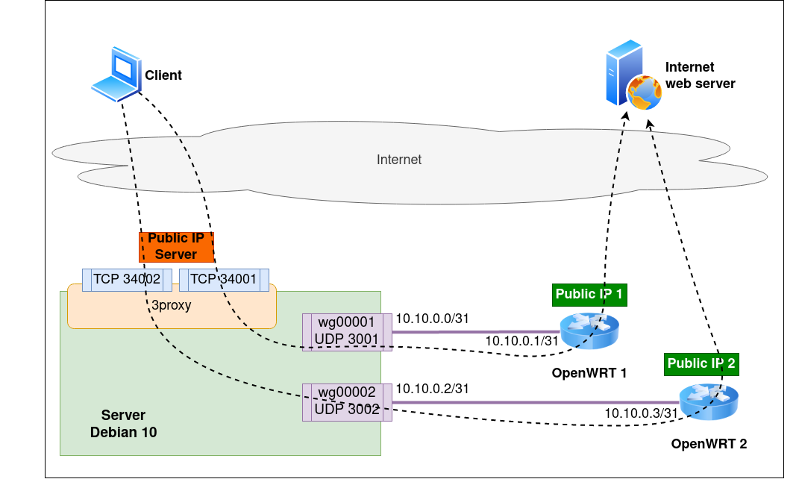

# Множественный выход в сеть через Wireguard тоннели

[English version](README.md)

## Описание

Использование wireguard для тоннелирования пакетов от прокси через удаленный маршрутизаторы OpenWRT

### Схема



### Файлы

| Файл                  |  Описание                                        |
|-----------------------|--------------------------------------------------|
| create_tunnel.sh      | Создать файлы конфигурации для тоннеля           |
| start_tunnel.sh       | Запустить интерфейс тоннеля                      |
| stop_tunnel.sh        | Остановить интерфейс тоннеля                     |
| show_tunnel.sh        | Показать системную информацию по тоннелю         |
| getstat_tunnel.sh     | Показать статистику по тоннелю                   |
| wrt_create_tunnel.sh  | Вывести команды для создания тоннеля на OpenWRT  |
| wrt_destroy_tunnel.sh | Вывести команды для удаления тоннеля на OpenWRT  |
| source.sh             | Общие переменные и функции                       |

## Использование

### Установка Wireguard

##### Debian сервер

```bash
sudo apt-get update
sudo apt-get install wireguard
```

##### OpenWRT

```bash
opkg update
# 21.02 or above
opkg install wireguard-tools
# 19.07 or lower
opkg install wireguard
```

### Wireguard скрипты (на сервере)

##### Скачать репозиторий

```bash
git clone https://github.com/LovingFox/reverse_vpn.git
cd reverse_vpn
```

##### Создать файлы конфигурации для wireguard тоннеля

```bash
./create_tunnel.sh <ID> <IP> <IP remote> <UDP> <table ID> <rule ID>
```

Команда создаст файлы конфигурации для тоннеля в директории `./db`

1. `<ID>` уникальный идентификатор тоннеля -- произвольное число
1. `<IP>` IP адрес тоннеля на сервере
1. `<IP remote>` IP адрес тоннеля на удаленном устройстве (на OpenWRT)
1. `<UDP>` порт UDP, который бедет использовать wiregard
1. `<table ID>` уникальный идентификатор таблицы маршрутизации для тоннеля (*ip route show table `<table ID>`*)
1. `<rule ID>` уникальный идентификатор ip-правила для тоннеля (*ip rule show pref `<table ID>`*)

> `<IP>` и `<IP remote>` должны быть в одной подсети /31

Пример

```bash
./create_tunnel_files.sh 1 10.10.0.0 10.10.0.1 3001 1001 1001
./create_tunnel_files.sh 2 10.10.0.2 10.10.0.3 3001 1001 1001
```

##### Запуск тоннеля

```bash
./start_tunnel.sh <ID | wg interface | IP local | IP remote | all>
```

> `<parameter>` может быть не один, разделяются пробелом  
`all` приведет к тому, что будут зpатронуты все тоннели из директории `./db`

Пример

```bash
./start_tunnel.sh 1
./start_tunnel.sh 1 2
./start_tunnel.sh wg00001
./start_tunnel.sh wg00001 wg00002
./start_tunnel.sh 10.10.0.0
./start_tunnel.sh 10.10.0.1
./start_tunnel.sh 10.10.0.2
./start_tunnel.sh 10.10.0.0 10.10.0.2
./start_tunnel.sh wg00001 10.10.0.0
./start_tunnel.sh all
```

> такой же подход применим и ко всем следующим командам

##### Остановить тоннель

```bash
./stop_tunnel.sh <ID | wg interface | IP local | IP remote>
```

##### Показать системную информацию по тоннелю

```bash
./show_tunnel.sh <ID | wg interface | IP local | IP remote>
```

##### Показать статистику по тоннелю

```bash
./getstat_tunnel.sh <ID | wg interface | IP local | IP remote>
```

Пример

```bash
$ ./getstat_tunnel.sh all
***|  UP   wg00001  3001       10.10.0.0    192.168.200.13:52122  100
 **|  UP   wg00002  3002       10.10.0.2    192.168.200.14:38762  126
  o|  UP   wg00004  3004       10.10.0.6     192.168.208.4:60955  10339
***|  UP   wg00005  3005       10.10.0.8     192.168.208.5:38798  36
   |       wg00009  3009      10.10.0.16              (no_iface)
  -|  UP   wg00010  3010      10.10.0.18                  (none)  -
***|  UP   wg00011  3011      10.10.0.20    192.168.208.11:59157  18
```

* `***|` был активен менее 150 секунд назад
* ` **|` был активен менее 600 секунд назад
* ` o|` не был активен более 600 секунд
* ` -|` никогда не был активен с момента запуска
* ` |` не существует, как системный интерфейс

##### Показать shell команды для создания и удаления тоннеля на OpenWRT 

```bash
./wrt_create_tunnel.sh <ID | wg interface | IP local | IP remote>
./wrt_destroy_tunnel.sh <ID | wg interface | IP local | IP remote>
```

> Для корректировки адреса сервера при отображении команд, можно изменить переменную `SERVER` на нужное значение

```bash
export SERVER=1.1.1.1
./wrt_create_tunnel.sh 1
```

##### Удалить всю информацию по тоннелю

Пример для тоннеля с идентификатором `1`

1. показать команды для удаления тоннеля на OpenWRT

    ```bash
    ./wrt_destroy_tunnel.sh 1
    ```

1. остановить тоннель на сервере

    ```bash
    ./stop_tunnel.sh 1
    ```

1. удалить связанные с тоннелем файлы из директории `./db`

    ```bash
    rm -r ./db/00001_*
    ```

### Пример конфигурации 3Proxy для тоннелей

```conf
proxy -e10.10.0.0   -i172.16.96.3 -p34001
proxy -e10.10.0.2   -i172.16.96.3 -p34002
```

172.16.96.3 - публичный IP-адрес сервера
